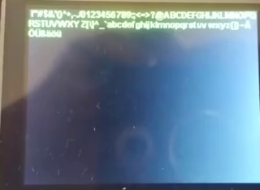
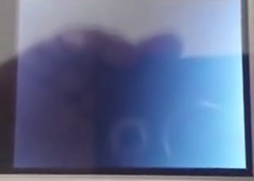

# ili9341-gfx-example

Example of using [ili9341-simple-gfx]() on STM32F429I
discovery kit.

## Overview

This is a testing and example project to test the [ili9341-simple-gfx]()
on STM32F429I discovery kit.

The project is using STM32CubeIDE, STM32CubeMX generated code skeleton and HAL layer as basis and can be used as quick to run
reference of how to use the [ili9341-simple-gfx]().

The application inistantiates one display driver instance and loops over the following steps to test the API functions:

* Draw horizontal lines of increasing thickness using R G B colors and screen rotations
* Draw vertical lines of increasing thickness  using R G B colors and screen rotations

* Draw rectangle of increasing border thickness using different screen rotations
* Draw filled rectangle of increasing border thickness using different screen rotations

* Draw diagonal line pixel after pixel
* Draw angled lines
* Draw pixmap with and without transparency.

* Drawing UTF-8 characters from TrueType fonts
* Different sizes
* Horizontal and vertical alignment

